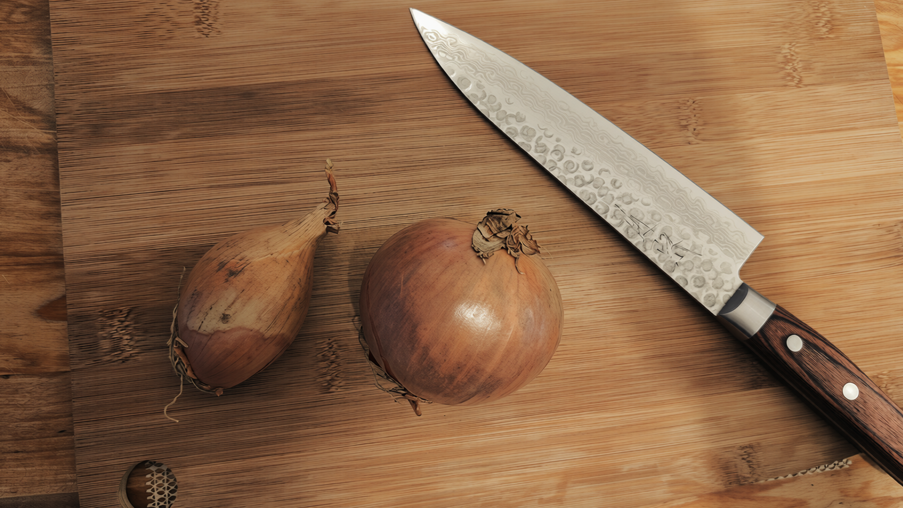
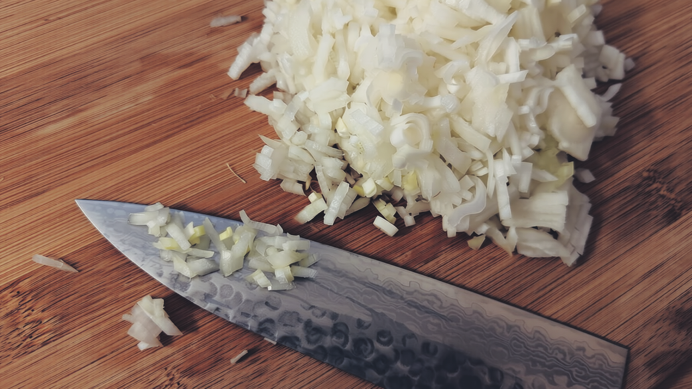
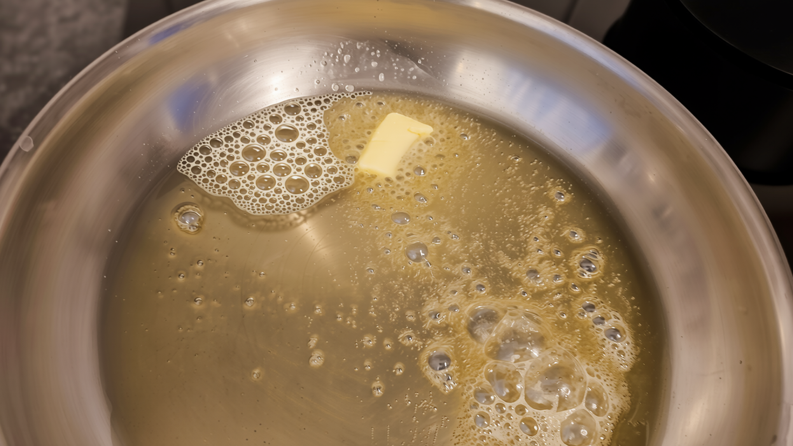
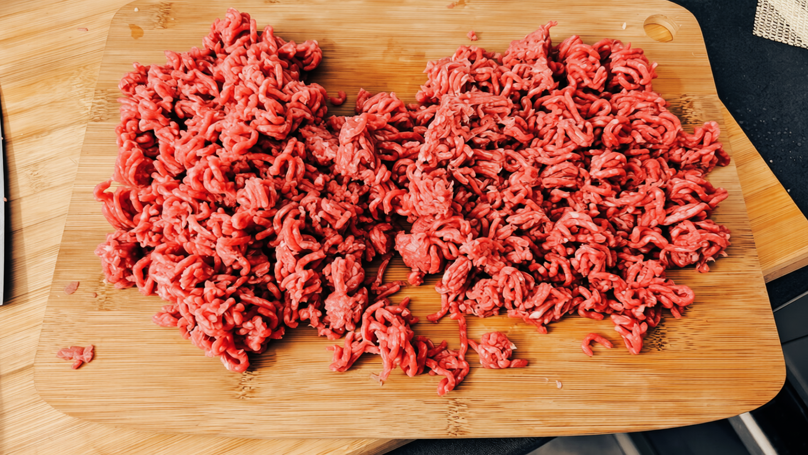
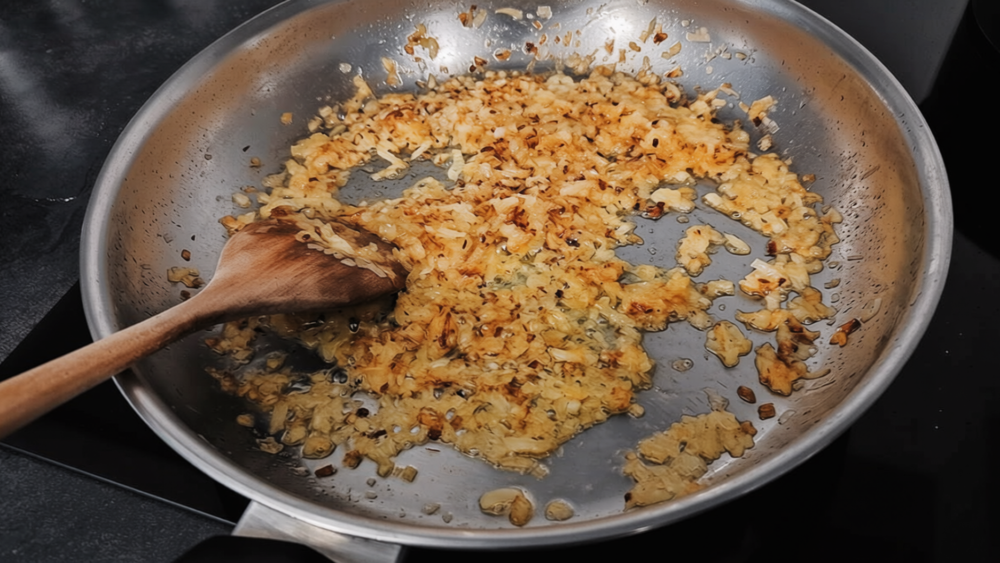
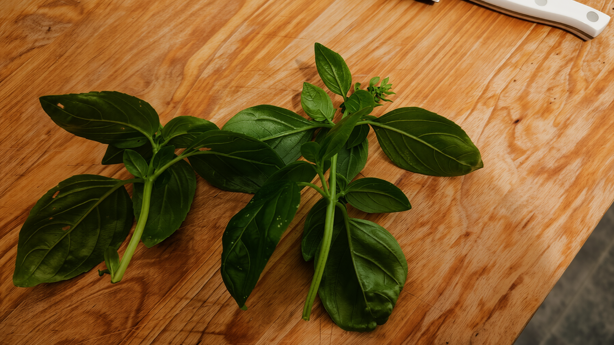
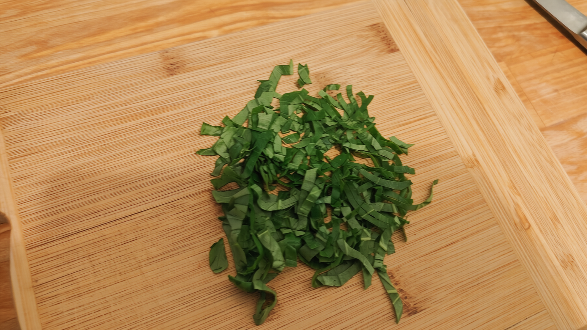
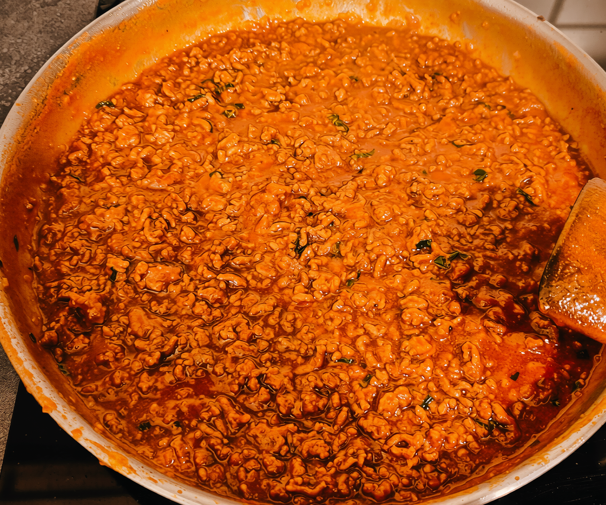

Sauce tomate gourmande au boeuf pour ~2-3 personnes.

## Préparation

- <b>Faire chauffer la poêle.</b>
- Préparer les oignons, environ un gros oignon et demi.

- Les couper très finement, cela aidera à avoir davantage de caramélisation <i>(plus de surface)</i>.

- Une fois que la poele est à bonne température, faire fondre une noix de beurre sur l'huile d'olive.  La bonne température est le point où le beurre mousse à l'ajout sans bruler.  La matière grasse va aider à caraméliser intensément les oignons sans les brûler.  Pas de panique car c'est la seule matière grasse ajoutée de la recette.

- Versez les oignons et les saler.
- <b> Faire chauffer l'eau des pates et saler l'eau.</b>
- Faire cuire les oignons à couvert, avec un température plus élevée qu'à la normale (à la découverte). Cela permet de garder de l'humidité et ainsi de les faire caraméliser davantage sans les brûler.
- Remuer régulièrement pour éviter que les oignons ne brûlent.  En revanche, <b>bien veiller à reverser l'humidité condensée sur le couvercle dans la poêle afin de continuer à garder les oignons humides et éviter qu'ils ne brûlent</b>. S'ils deviennent trop secs, ajouter soit un peu d'eau, soit un peu de matière grasse.
- <b> Pendant ce temps, découper plus finement le boeuf haché.</b>

- Les oignons devraient être bien caramélisés mais pas brulés.  <i>Dans l'exemple ci-dessous, j'ai malheureusement attendu trop longtemps une fois, cela a rendu la caramélisation un peu trop hétérogène.  Le principal est d'avoir une caramélisation homogène et franche.</i>

- <b>Ajouter le boeuf haché.</b> Saler, poivrer, ajouter environ 3 cuillères à soupe de sauce huitre. Bien mélanger.  <i>(La sauce huitre n'a presque pas de goût mais va apporter la saveur umami à la viande, la rendant plus savoureuse.)</i>
- Faire cuire le boeuf à couvert. Il va libérer de l'humidité, mais la conserver pour le moment. Remuer régulièrement.
- Faire cuire les pates.
- Préparer le basilic, ne pas hésiter à en prendre une bonne quantité.

- Superposer et enrouler les feuilles de basilic, puis les ciseler.

- Une fois la viande quasiment cuite, continuer à cuire sans le couvercle afin de laisser le liquide s'évaporer.
- Les pâtes devraient être quasiment cuites.  Lorsque le liquide de la viande est quasiment évaporé, prendre deux louches de jus de cuisson des pâtes et les ajouter à la poêle.  Y ajouter une bonne cuillière à café de poudre de fond de veau. Bien mélanger.
- <b>Ici, le dosage est important:</b> Laisser réduire le jus de cuisson, de sorte qu'à l'ajout du coulis de tomates, il y ait 2/3 de volume de jus de tomates pour 1/3 de volume de jus de cuisson.
- Ajouter le coulis de tomates et le basilic.
- En fonction de l'acidité du coulis de tomates, ajouter du sucre.  2 cuillères à soupe de sucre est en général la moyenne. Garder à l'esprit que la sucrosité va devenir plus intense au fil de la réduction de la sauce.
- <b>Réduire la sauce à feu plus doux.</b>  Les bulles sont épaisses dûes à la viscosité de la sauce tomate.  <i>Lorsque les bulles deviennent beaucoup plus fines, cela indique que l'eau est trop remontée à la surface, il faut alors mélanger pour éviter de faire bruler la sauce.</i>
- Réduire en fonction de la viscosité finale souhaitée.
- Lorsque la sauce est quasiment prête, il y a très probablement un déséquilibre de saveur (trop peu de sel par rapport au sucre).  Ajouter alors le sel pour rectifier l'assaisonnement.  Le sel doit être légèrement plus présent que le sucre à ce stade, car le parmesan va encore ajouter du sel.  <b>Aussi, attention lors du goutage de l'équilibre de la sauce: gouter une trop petite quantité va donner l'impression que la sauce est moins sucrée qu'en réalité.</b>
- Terminer la sauce. L'ajouter aux pâtes, mettre une bonne quantité de parmesan, et mélanger bien.

