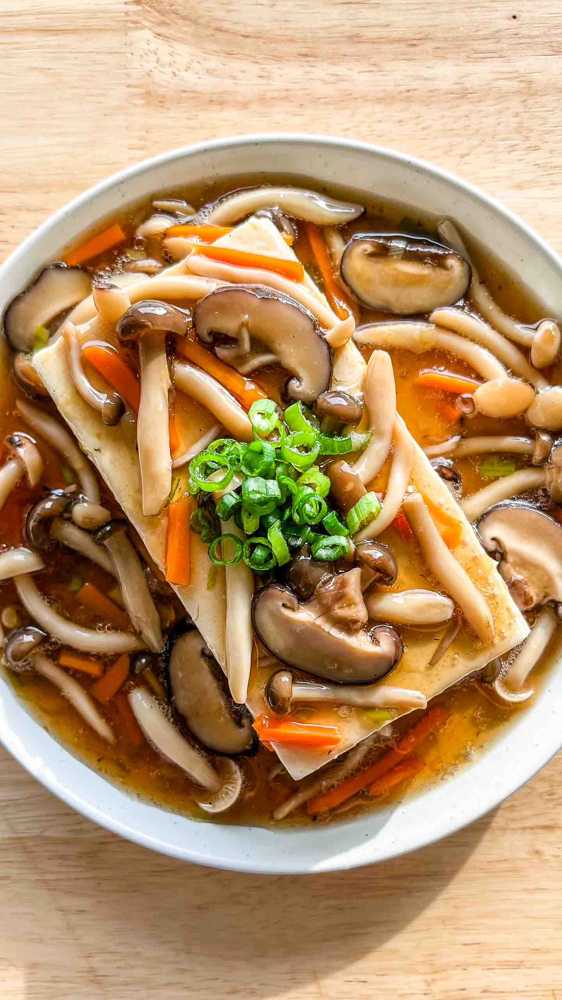

Pour X personnes. Temps de préparation : ... Temps de cuisson : ...

## Préparation

- Décrivez ici la première étape de la préparation.
- **Décrivez ici la deuxième étape**: de la préparation.
  - abc

1. Continuez avec toutes les étapes nécessaires.
